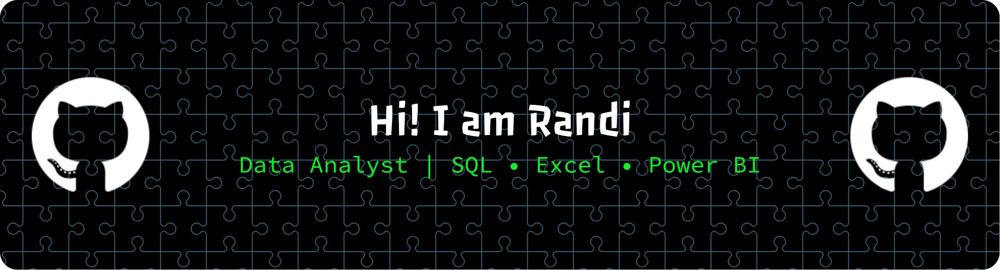

## Hello I'm Randi 👋



<!--
**hackerone432-commits/hackerone432-commits** is a ✨ _special_ ✨ repository because its `README.md` (this file) appears on your GitHub profile.

Here are some ideas to get you started:

- 🔭 I’m currently working on ...
- 🌱 I’m currently learning ...
- 👯 I’m looking to collaborate on ...
- 🤔 I’m looking for help with ...
- 💬 Ask me about ...
- 📫 How to reach me: ...
- 😄 Pronouns: ...
- ⚡ Fun fact: ...
-->


### Data Analyst | SQL • Excel • Power BI

I'm a Data Analyst enthusiast focused on transforming raw data into
meaningful insights that support better business decisions.

I enjoy working with data cleaning, analysis, visualization, reporting,
and business problem solving.

---

## 🛠️ Tools & Skills

### Data Analysis & Database


### Excel & Business Intelligence


### Version Control


---

## 📊 Data Analytics Skills

- Data Cleaning
- Data Transformation
- Exploratory Data Analysis
- Descriptive Analysis
- Diagnostic Analysis
- Predictive Analysis
- Prescriptive Analysis
- Data Visualization
- Business Reporting
- Business Insight & Recommendations
- Data Modeling
- KPI Analysis

---

## 💻 What I Work With

### SQL
- Data extraction
- Filtering and aggregation
- JOIN
- CTE
- Subqueries
- Window Functions
- Data Cleaning
- Business Analysis

### Excel
- Data Cleaning
- Power Query
- PivotTable
- Power Pivot
- DAX
- Data Analysis
- Business Reporting
- Data Visualization

### Power BI
- Data Transformation
- Data Modeling
- Relationships
- DAX Measures
- KPI Development
- Interactive Reports
- Business Intelligence

---

## 📂 Featured Projects

### 🧹 SQL Data Cleaning

Data cleaning projects using SQL to identify and handle:

- Missing values
- Duplicate records
- Inconsistent data
- Invalid values
- Data standardization

**Tools:** Google BigQuery • PostgreSQL • SQL

---

### 📊 Excel Data Analysis

Business analysis projects using Excel to transform raw data
into meaningful reports and insights.

**Tools:** Excel • Power Query • PivotTable • DAX

---


### 📈 Power BI Dashboard

Interactive business intelligence dashboards designed to analyze
business performance and support data-driven decision making.

**Tools:** Power BI • Power Query • DAX • Data Modeling

---


## 🎯 Currently Learning

I'm continuously improving my skills in:

- Advanced SQL
- Data Modeling
- DAX
- Power BI
- Business Analytics
- Statistical Analysis
- Data Storytelling

---

## 📌 My Approach to Data Analysis

I follow a structured approach when working with data:

```text
Business Problem
       ↓
Data Collection
       ↓
Data Cleaning
       ↓
Data Transformation
       ↓
Data Modeling
       ↓
Data Analysis
       ↓
Data Visualization
       ↓
Business Insights
       ↓
Recommendations
```
---
## 📫 Connect With Me

[](https://www.linkedin.com/in/moh-randi-5a64b93a0/)

## 🐍 Contribution Snake

<p align="center">
  
</p>
